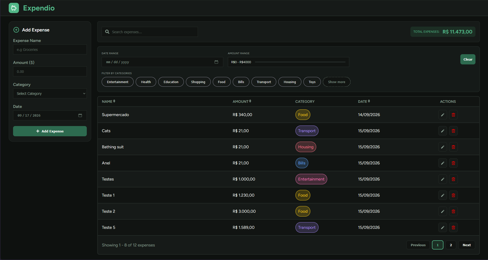

# 💸 Expense Tracker

A simple expense tracker built with React to practice building a complete CRUD application and working with state, filtering, sorting, and persistent data.

## 📸 Preview



## 🚀 Features

- Add, edit and delete expenses
- Create custom categories with custom colors
- Filter expenses by:
  - Category
  - Date
  - Amount
- Search and manage categories
- Sort expenses by name, amount and date
- Pagination
- Persistent data using `localStorage`
- Responsive interface

## 🛠️ Built With

- [React](https://react.dev/)
- JavaScript
- CSS
- [Vite](https://vite.dev/)
- [React Icons](https://react-icons.github.io/react-icons/)
- Browser `localStorage`

## 💾 Data Persistence

The app currently uses the browser's `localStorage` to save expenses and categories.

This means your data remains available when you refresh the page or come back to the application later.

## 🖥️ Running Locally

Clone the repository:

```bash
git clone https://github.com/your-username/expense-tracker.git